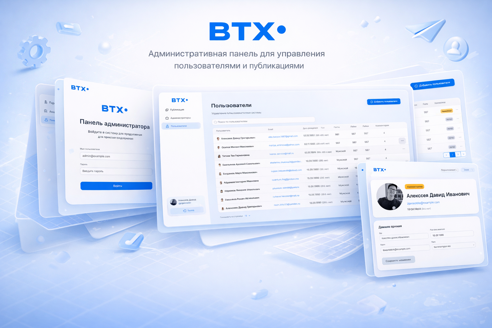

# BTX Admin Panel

Admin panel for managing BTX entities with real-time updates via Socket.IO.


---

## Tech Stack

- **Next.js 16** (App Router)
- **TypeScript**
- **HeroUI** — UI components
- **Tailwind CSS** — styling
- **SCSS** — global styles and modules
- **Zustand** — state management
- **TanStack Query** — API requests
- **Socket.IO** — real-time communication
- **JWT** — authentication (token in cookies)

---

## Getting Started

### 1. Install dependencies

```bash
npm install
```

### 2. Create .env.local

Create a `.env.local` file in the project root:

```env
NEXT_PUBLIC_API_URL=https://test-api.live-server.xyz/
SOCKET_ORIGIN=http://localhost:3000
```

### 3. Run the Next.js application

```bash
npm run dev
```

App will be available at: **http://localhost:3000**

### 4. Run Socket.IO server (separate terminal)

```bash
npm run socket
```

Socket server will run at: **http://localhost:3001**

---

## Project Structure (simplified)

```
.
├── app/                    # Next.js App Router
├── components/
├── hooks/
│   └── useSocket.ts
├── providers/
│   └── SocketProvider.tsx
├── socket-server.js        # Socket.IO server
├── public/
├── .env.local
├── package.json
└── README.md
```

---

## Socket Architecture

- `socket-server.js` runs as a separate Node.js process
- Client connects via socket.io-client
- CORS is restricted via `SOCKET_ORIGIN`
- Socket URL defaults to `http://localhost:3001` if not configured

---

## Development Notes

- React Strict Mode may cause effects to run twice in development
- Socket initialization is protected via `useRef`
- Do not hardcode socket URLs in client code
- Restart both servers after changing `.env.local`

---

## Scripts

```bash
npm run dev       # Start Next.js app
npm run socket    # Start Socket.IO server
npm run build     # Build production app
npm run start     # Start production app
```
